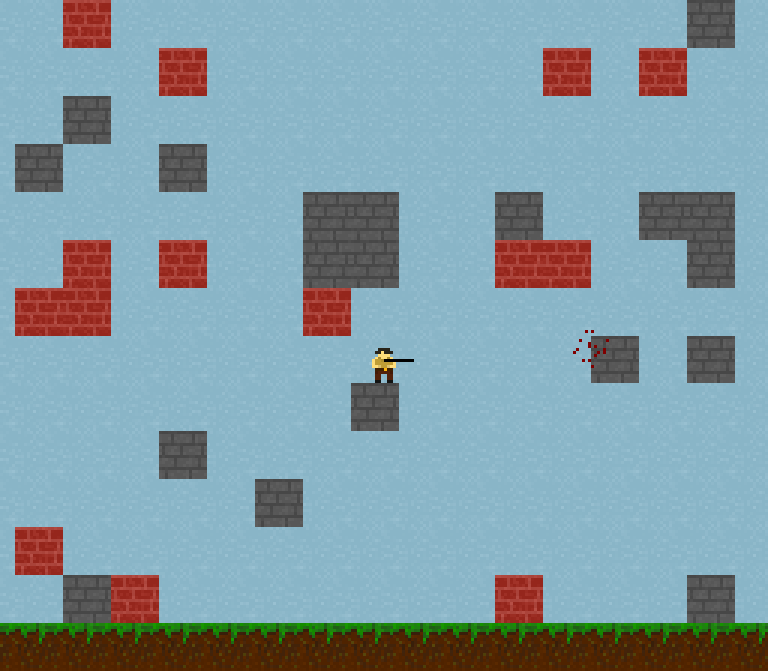

# LD01
8 hours for develop a small game for refresh my skill.

## Preview

## Compile on Linux
``g++ -o pocketgame main.cpp -lX11 -lGL -lpthread -lpng -lstdc++fs -std=c++17``

## Key bindings
- Moving : W,A,S,D or Arrow Keys
- Aim : Mouse
- Shoot : Left mouse button

## Libraries
This project use the very useful library **olcPixelGameEngine**  
https://github.com/OneLoneCoder/olcPixelGameEngine
